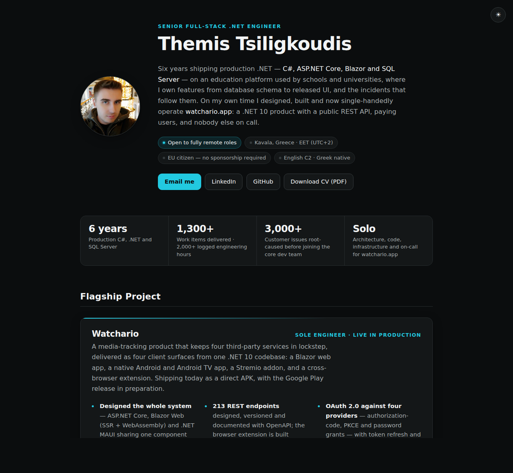
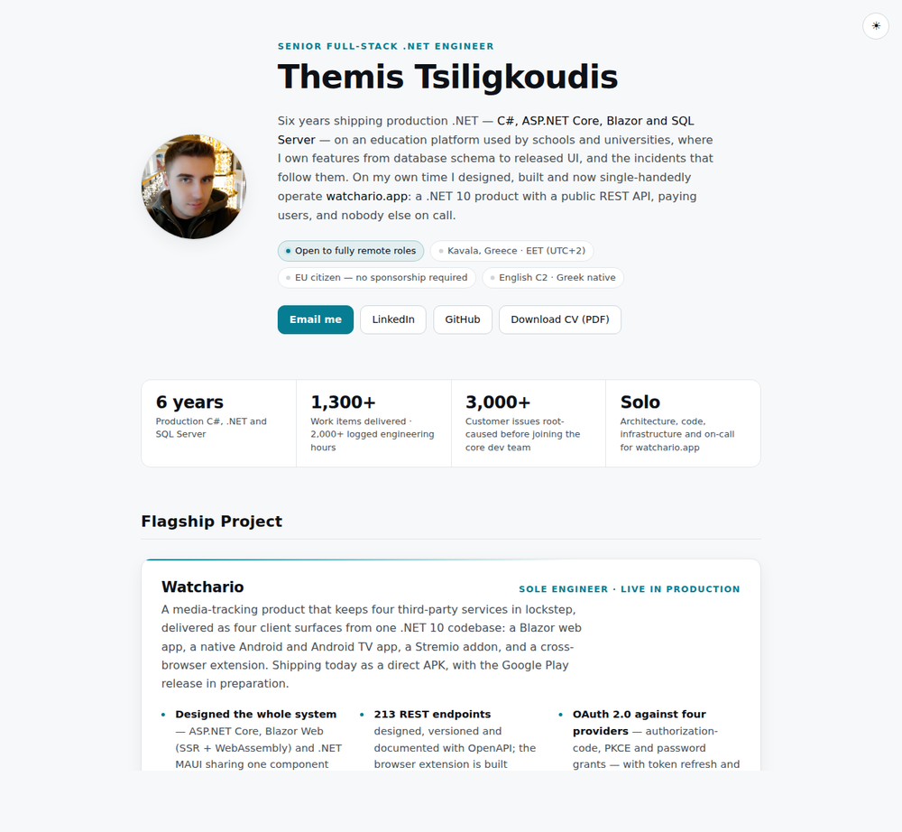

# Themis Tsiligkoudis — Digital Résumé

Live at **[myportofolio.eu](https://myportofolio.eu/)**.

A hand-written résumé and portfolio site: no framework, no build step, no dependencies —
two HTML pages, one stylesheet and 60 lines of JavaScript. It doubles as the source of my
PDF CV, which is printed straight from `index.html` so the two can never drift apart.

| | |
|---|---|
| **Résumé** | [`index.html`](./index.html) — experience, stack, projects |
| **Case study** | [`watchario.html`](./watchario.html) — the engineering behind [watchario.app](https://watchario.app) |
| **PDF CV** | [`assets/Themis-Tsiligkoudis-CV.pdf`](./assets/Themis-Tsiligkoudis-CV.pdf) — generated from the résumé page |

## Preview

<p></p>
<p></p>

## How it is built

- **Theme.** Light and dark both defined in `styles/main.css`. The visitor's OS preference
  decides by default; the toggle overrides it and persists in `localStorage`. An inline
  script in `<head>` applies the stored choice before first paint, so the page never flashes
  the wrong theme.
- **Print.** `@media print` in the same stylesheet re-renders the page as a paper CV on
  **A4** (`@page { size: A4 }` — Chromium would otherwise default to US Letter): ink-friendly
  colours, tighter type, link targets surfaced as text since a printed `<a>` has nowhere to go,
  and pagination rules that keep every bullet, role, stack row and project card whole rather
  than letting one split across a page boundary.
- **Discoverability.** `schema.org/Person` JSON-LD, Open Graph and Twitter card metadata,
  a canonical URL, `robots.txt` and `sitemap.xml`.
- **Accessibility.** Skip link, visible focus rings, semantic landmarks, `prefers-reduced-motion`,
  and text that clears WCAG AA contrast in both themes.

## Regenerating the PDF

The CV is Chromium's print output for `index.html`, so editing the page is the only way the
PDF changes. The page size comes from the stylesheet, so no paper flag is needed:

```bash
chromium --headless --no-pdf-header-footer \
  --print-to-pdf=assets/Themis-Tsiligkoudis-CV.pdf \
  "file://$PWD/index.html"
```

## Running locally

Any static server will do — the site has no build step:

```bash
python3 -m http.server 5501
```
